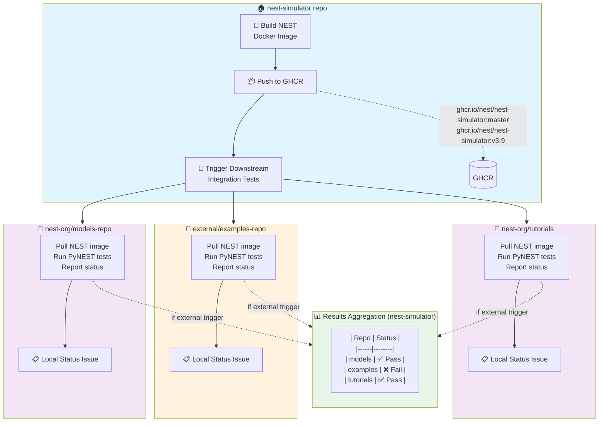
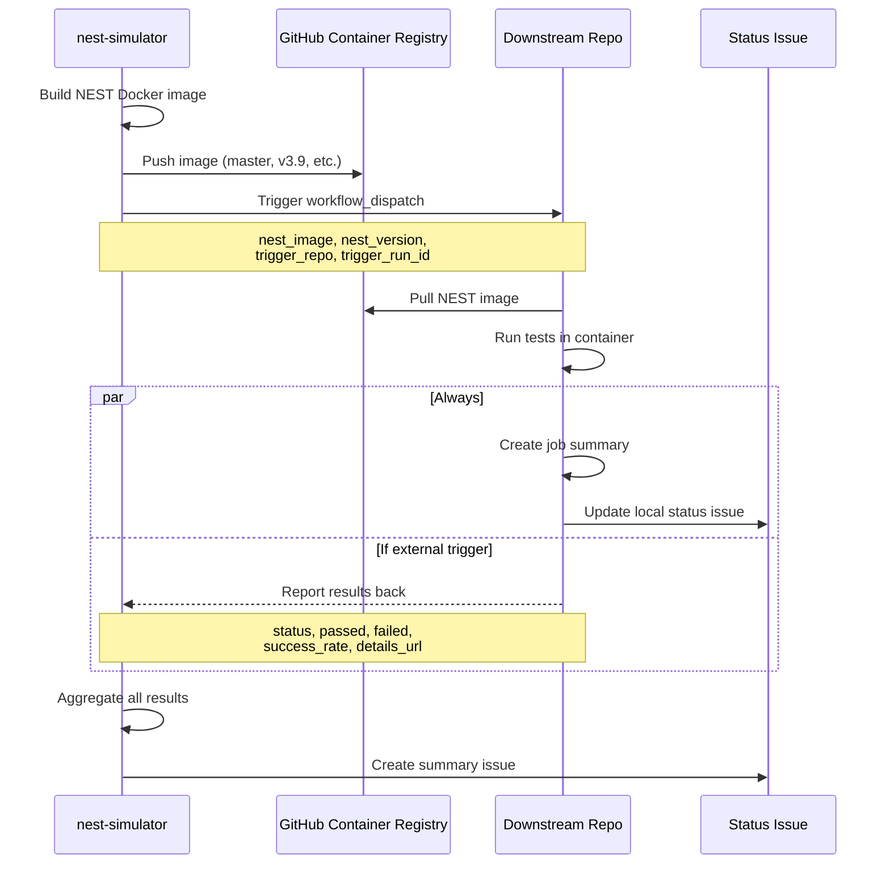
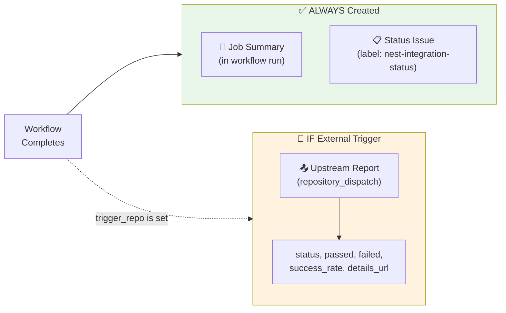
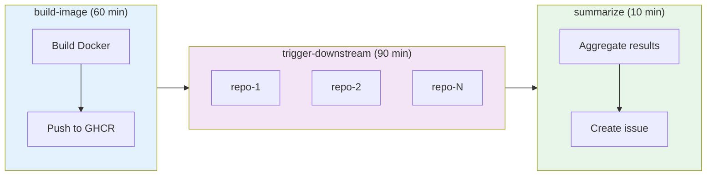
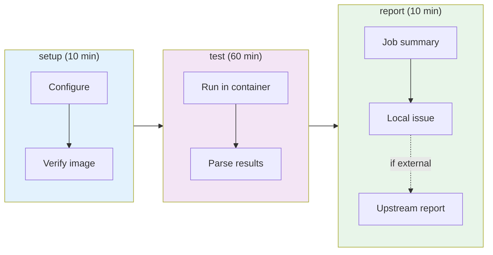
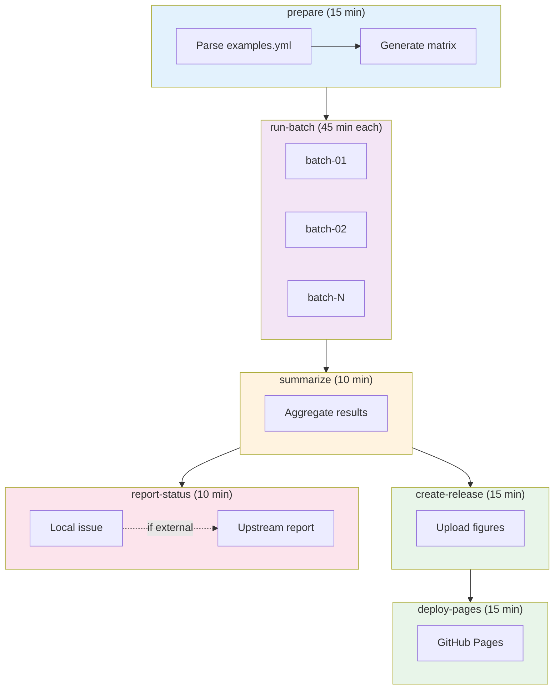

# Cross-Repository CI Architecture for NEST Integration Testing

This document describes a CI/CD architecture for testing PyNEST implementations across multiple repositories using Docker images from the nest-simulator repository.

## Overview

The goal is to create a workflow system where:

1. The `nest-simulator` repo builds and publishes Docker images (master builds, release candidates)
2. These images are used to test PyNEST code in multiple downstream repositories
3. Results from all downstream repos are collected and reported back to `nest-simulator`
4. Each downstream repo also maintains its own status visibility

## Architecture Diagram



### Sequence Diagram



---

## Dual Visibility Pattern

A key feature of this architecture is **dual visibility** - test results are visible in both:

1. **The downstream repository** (local status issue + job summary)
2. **The upstream nest-simulator repository** (aggregated results)



**When `trigger_repo` is set** (external trigger from nest-simulator):
- All three outputs are created
- nest-simulator receives the results for aggregation

**When `trigger_repo` is empty** (manual or scheduled):
- Only local outputs (job summary + status issue)
- No upstream communication needed

---

## Files in This Repository

### Workflow Files

| File | Purpose | Use In |
|------|---------|--------|
| `.github/workflows/downstream-integration.yml` | Orchestrates cross-repo testing | nest-simulator repo |
| `.github/workflows/nest-integration-template.yml` | Template for downstream repos | Any downstream repo |
| `.github/workflows/examples-container.yml` | Container-based example runner | This examples repo |
| `.github/workflows/examples-test.yml` | Legacy artifact-based runner | This examples repo |

### Supporting Files

| File | Purpose |
|------|---------|
| `Dockerfile.nest-ci` | Example Dockerfile for NEST CI image |
| `pynest/examples/examples.yml` | Configuration for which examples to run |

---

## Workflow Details

### 1. downstream-integration.yml (for nest-simulator)

**Purpose:** Orchestrate integration testing across all downstream repositories.

**Triggers:**
- Push to master branch
- Release published
- Manual dispatch
- Scheduled (2 AM UTC daily)

**Jobs:**



**Best Practices Applied:**
- Concurrency control (prevents duplicate runs)
- Job timeouts (60/90/10 minutes)
- Fail-fast disabled (get results from all repos)
- Matrix strategy for parallel downstream testing

### 2. nest-integration-template.yml (for downstream repos)

**Purpose:** Template that downstream repos copy and customize.

**Triggers:**
- External (workflow_dispatch from nest-simulator)
- Manual (from repo's Actions tab)
- Scheduled (5 AM UTC daily)
- On push (optional, commented out)

**Jobs:**



**Customization Points:**
```yaml
# In the 'test' job, modify:
- name: Install additional dependencies
  run: pip install -r requirements.txt  # Your deps

- name: Run tests
  run: pytest tests/ -v  # Your test command
```

### 3. examples-container.yml (for this repo)

**Purpose:** Run PyNEST examples using NEST Docker image.

**Triggers:**
- External (workflow_dispatch from nest-simulator)
- Manual (from Actions tab)
- Scheduled (4 AM UTC daily)

**Jobs:**



**Features:**
- Batched parallel execution (5 concurrent batches)
- Figure collection and release creation
- GitHub Pages deployment
- Dual status reporting

---

## Best Practices Applied

All workflows follow these GitHub Actions best practices:

| Practice | Implementation |
|----------|---------------|
| **Concurrency Control** | `concurrency` block prevents duplicate runs |
| **Job Timeouts** | `timeout-minutes` on every job |
| **Minimal Permissions** | `permissions` block per job |
| **Fail Gracefully** | `continue-on-error` for optional steps |
| **Ubuntu Version** | Using `ubuntu-24.04` (latest LTS) |
| **Artifact Retention** | 7-30 days based on importance |

---

## Authentication Requirements

### Personal Access Tokens (PATs)

| Token | Scope | Purpose | Stored In |
|-------|-------|---------|-----------|
| `DOWNSTREAM_TRIGGER_PAT` | `repo`, `actions` | Trigger downstream workflows | nest-simulator secrets |
| `UPSTREAM_REPORT_PAT` | `repo` | Report results back (optional) | Downstream repo secrets |

### Same Organization vs. Different Organization

| Scenario | Authentication | Notes |
|----------|----------------|-------|
| Same org repos | Fine-grained PAT or classic PAT | Simpler setup |
| Different org repos | Classic PAT with `repo` scope | User must have access to both |
| Public GHCR images | No auth for pull | Recommended for simplicity |

---

## Trigger Flow Explained

### External Trigger (from nest-simulator)

```yaml
# nest-simulator triggers downstream with these inputs:
inputs:
  nest_image: "ghcr.io/nest/nest-simulator:master"
  nest_version: "abc1234"
  trigger_repo: "nest/nest-simulator"      # ← This marks it as external
  trigger_run_id: "12345678"
  trigger_sha: "abc1234def5678"
```

When `trigger_repo` is set:
- `is_external_trigger` = `true`
- Workflow reports back to nest-simulator after completion

### Manual/Scheduled Trigger

```yaml
# User triggers manually or cron runs:
inputs:
  nest_image: "ghcr.io/nest/nest-simulator:v3.9"
  nest_version: "v3.9"
  # trigger_repo is NOT set
```

When `trigger_repo` is empty:
- `is_external_trigger` = `false`
- No upstream reporting (results stay local only)

---

## Quick Start

### 1. Set up nest-simulator repository

```bash
# Copy the orchestration workflow
cp .github/workflows/downstream-integration.yml \
   /path/to/nest-simulator/.github/workflows/

# Copy the Dockerfile
cp Dockerfile.nest-ci /path/to/nest-simulator/Dockerfile

# Create PAT with repo + actions scope
# Add as secret: DOWNSTREAM_TRIGGER_PAT
```

### 2. Set up each downstream repository

```bash
# Copy the template
cp .github/workflows/nest-integration-template.yml \
   /path/to/downstream-repo/.github/workflows/nest-integration.yml

# Customize the test commands (look for "CUSTOMIZE THIS SECTION")
# Optionally add UPSTREAM_REPORT_PAT secret for bidirectional reporting
```

### 3. Update downstream-integration.yml matrix

```yaml
matrix:
  repo:
    - name: my-models
      owner: my-org
      repo: my-nest-models
      workflow: nest-integration.yml
      timeout: 30  # minutes
```

### 4. Test manually

```bash
# Trigger from nest-simulator
gh workflow run downstream-integration.yml --repo nest/nest-simulator

# Or trigger a single downstream repo directly
gh workflow run nest-integration.yml \
  --repo my-org/my-models \
  -f nest_image=ghcr.io/nest/nest-simulator:master \
  -f nest_version=dev-latest
```

---

## Image Tagging Strategy

| Tag | Description | Use Case |
|-----|-------------|----------|
| `master` | Latest master branch build | CI testing |
| `v3.9` | Stable release | Production |
| `v3.9-rc1` | Release candidate | Pre-release validation |
| `sha-abc1234` | Specific commit | Debugging |

---

## Troubleshooting

| Issue | Cause | Solution |
|-------|-------|----------|
| "Resource not accessible" | PAT lacks permissions | Check token scopes |
| Workflow not triggered | Wrong event type | Verify workflow_dispatch inputs |
| Image pull failed | Private image | Make GHCR image public |
| Timeout waiting | Slow tests | Increase `timeout` in matrix |
| No upstream report | Missing PAT | Add `UPSTREAM_REPORT_PAT` secret |

### Debugging Commands

```bash
# List recent workflow runs
gh run list --repo org/repo --limit 10

# View run details
gh run view 123456789 --repo org/repo

# Manually trigger workflow
gh workflow run nest-integration.yml \
  --repo org/downstream-repo \
  -f nest_image=ghcr.io/nest/nest-simulator:master
```

---

## Implementation Checklist

### nest-simulator Repository

- [ ] Create Dockerfile for NEST with all dependencies
- [ ] Add workflow to build/publish Docker image to GHCR
- [ ] Add `downstream-integration.yml` workflow
- [ ] Create `DOWNSTREAM_TRIGGER_PAT` secret
- [ ] Update matrix with actual downstream repos

### Each Downstream Repository

- [ ] Copy and customize `nest-integration-template.yml`
- [ ] Test manually with `gh workflow run`
- [ ] (Optional) Add `UPSTREAM_REPORT_PAT` for bidirectional reporting
- [ ] Document any additional dependencies

### Organization Settings

- [ ] Allow GitHub Actions to create issues
- [ ] Make GHCR images public (or configure auth)
- [ ] Set up organization secrets if applicable
